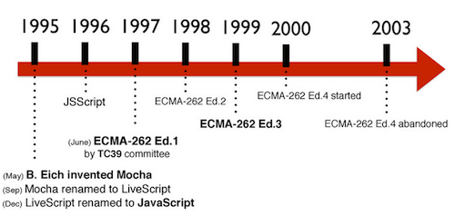
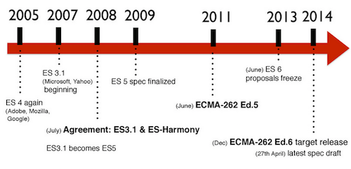

# ES6

ECMAScript v6 (Abreviado como ES6 o ES2015) es el estándar que seguirá JavaScript a partir de Junio de este año (2015). Hasta el momento la versión de JS que estamos usando en nuestros navegadores y Node.js, es la v5.

# La evolución de JavaScript

Primero un poco de historia. En 1995 (hace 20 años!) Brendan Eich crea un lengujea llamado Mocha cuando trabajaba en Netscape. En Septiembre de ese año lo renombra a LiveScript hasta que le cambiaron el nombre a JavaScript debido a una estrategia de marketing, ya que Netscape fue adquirida por Sun Microsystems, propietaria del lenguaje Java, muy popular por aquel entonces.

### ¡Advertencia!: aclarar lo siguiente Java != JavaScript.

En 1997 se crea un comité (TC39) para estadarizar JavaScript por la European Computer Manufacturers' Association, ECMA. Se diseña el estándar del DOM (Document Object Model) para evitar incompatibilidades entre navegadores. A partir de entonces los estándares de JavaScript se rigen por ECMAScript.



En 1999 aparece la 3a versión del estándar ECMAScript, que se mantendría vigente hasta hace pocos años. Hubo pequeños intentos de escribir la versión 4, pero hasta 2011 no se aprobó y se estandarizó la versíon 5 (ES5) que es la que usamos hoy en día.



En junio de 2013 quedó parado el borrador de la versión 6, pero en Diciembre de 2014 se aprobó al fin y se espera su estandarización a partir de Junio de 2015.

# JavaScript

Un programa de computadora es una lista de "instrucciones" a ser "ejecutados" por el ordenador.

En un lenguaje de programación, estas instrucciones de programa se llaman declaraciones .

JavaScript es un lenguaje de programación .

Las sentencias de JavaScript están separados por puntos y comas .

## Ejemplo
``` javascript
var x = 5;
var y = 6;
var z = x + y;
```
# Declaraciones de JavaScript

Las sentencias de JavaScript se componen de:

Valores, operadores, expresiones, palabras clave y comentarios.

# Los valores de JavaScript
La sintaxis de JavaScript define dos tipos de valores: Los valores fijos y valores de variables.

Los valores fijos se denominan literales . Los valores de datos variables se llaman variables.

# Las literales de JavaScript
Las reglas más importantes para la escritura de valores fijos son:

Los números se escriben con o sin decimales:

```javascript
10.50

1001
```

Las cadenas son texto, escrito entre comillas dobles o simples:

```javascript
"John Doe"

'John Doe'
```

# Las variables de JavaScript
En un lenguaje de programación, las variables se utilizan para almacenar valores de datos.

JavaScript utiliza la palabra clave var para declarar variables.

Un signo igual se utiliza para asignar valores a las variables.

En este ejemplo, x se define como una variable. Entonces, x se asigna (dado) el valor 6:

```javascript
var x;

x = 6;
```

# Las variables de JavaScript
Las variables en JavaScript son contenedores para el almacenamiento de valores de datos.

En este ejemplo, x, y, y z, son variables:
```javascript
Ejemplo
var x = 5;
var y = 6;
var z = x + y;
```
En el ejemplo anterior, se puede esperar:

x almacena el valor 5
y almacena el valor 6
tiendas z el valor 11

Al igual que Álgebra
En este ejemplo, price1, price2, y total, son variables:

Ejemplo
```javascript
var price1 = 5;
var price2 = 6;
var total = price1 + price2;
```
En la programación, al igual que en el álgebra, utilizamos variables (como price1) para contener valores.

En la programación, al igual que en el álgebra, utilizamos variables en expresiones (= Total + price1 price2).

En el ejemplo anterior, se puede calcular el total a ser 11.

# Identificadores de JavaScript
Todas las variables de JavaScript deben ser identificados con nombres únicos .

Estos nombres únicos son llamados identificadores .

Los identificadores pueden ser nombres cortos (como X e Y) o nombres más descriptivos (edad, capital, totalVolume).

Las reglas para los nombres legales son muy similares en la mayoría de los lenguajes de programación.
Las normas generales para la construcción de nombres para las variables (identificadores únicos) son:

Los nombres pueden contener letras, dígitos, guiones y símbolos de dólar.
Los nombres deben comenzar con una letra
Los nombres también pueden comenzar con $ y _ (pero no vamos a utilizar en este tutorial)
Los nombres son mayúsculas y minúsculas (Y e Y son variables diferentes)
Las palabras reservadas (como palabras clave de JavaScript) no se pueden utilizar como nombres identificadores de JavaScript entre mayúsculas y minúsculas.
Los números no son permitidos como el primer carácter.
De esta manera JavaScript puede distinguir fácilmente identificadores de números.

# Los operadores de JavaScript
JavaScript utiliza un operador de asignación (=) para asignar valores a las variables:
```javascript
var x = 5;
var y = 6;
```
JavaScript utiliza operadores aritméticos (+ - * /) para calcular los valores:
```javascript
(5 + 6) * 10
```

Ejemplo
Asignar valores a las variables y sumarlos:
```javascript
var x = 5;         // assign the value 5 to x
var y = 2;         // assign the value 2 to y
var z = x + y;     // assign the value 7 to z (x + y)
```
## Los operadores aritméticos de JavaScript
Los operadores aritméticos se utilizan para realizar operaciones aritméticas con números (literales o variables).

Operator	Description
+	Addition
-	Subtraction
*	Multiplication
/	Division
%	Modulus
++	Increment
--	Decrement
La adición del operador (+) suma los números:

Adición
```javascript
var x = 5;
var y = 2;
var z = x + y;
```

La multiplicación del operador ( * ) multiplica los números.

multiplicando
```javascript
var x = 5;
var y = 2;
var z = x * y;
```

## Operadores de asignación de JavaScript

Los operadores de asignación asignan valores a las variables de JavaScript.
<table class="w3-table-all notranslate">
<tr>
<th style="width:25%">Operator</th>
<th>Example</th>
<th>Same As</th>
</tr>
<tr>
<td>=</td>
<td>x = y</td>
<td>x = y</td>
</tr>
<tr>
<td>+=</td>
<td>x += y</td>
<td>x = x + y</td>
</tr>
<tr>
<td>-=</td>
<td>x -= y</td>
<td>x = x - y</td>
</tr>
<tr>
<td>* =</td>
<td>x * = y</td>
<td>x = x * y</td>
</tr>
<tr>
<td>/=</td>
<td>x /= y</td>
<td>x = x / y</td>
</tr>
<tr>
<td>%=</td>
<td>x %= y</td>
<td>x = x % y</td>
</tr>
</table>


La asignación de operador ( = ) asigna un valor a una variable.

Asignación
```JavaScript
var x = 10;
```
La asignación de suma operador (+ =) añade un valor a una variable.

Asignación
```JavaScript
var x = 10;
x += 5;
```
## Operadores de cadena de JavaScript

El operador + también se puede utilizar para añadir cadenas de caracteres (concatenar).

Cuando se utiliza en cadenas, el operador + se llama el operador de concatenación.

Ejemplo
```JavaScript
txt1 = "John";
txt2 = "Doe";
txt3 = txt1 + " " + txt2;
```
El resultado de txt3 será:
John Doe

El operador + = asignación también se puede utilizar para agregar cadenas (concatenar):

Ejemplo
```javascript
txt1 = "What a very ";
txt1 += "nice day";
```
El resultado de txt1 será:

What a very nice day

## Adición de Cadenas y Números
La adición de dos números, devolverá la suma, pero la adición de un número y una cadena devolverá una cadena:

Ejemplo
```javascript
x = 5 + 5;
y = "5" + 5;
z = "Hello" + 5;
```

El resultado de x , y , y z será:

10
55
Hello5

La regla es: Si se agrega un número y una cadena, el resultado será una cadena!

## JavaScript comparación y operadores lógicos
Operator	Description
==	equal to
===	equal value and equal type
!=	not equal
!==	not equal value or not equal type
>	greater than
<	less than
>=	greater than or equal to
<=	less than or equal to
?	ternary operator

## El operador de asignación
En JavaScript, el signo igual (=) es un operador de "asignación", no un "igual a" operador.

Esto es diferente de álgebra. La siguiente no tiene sentido en el álgebra:

x = x + 5

En JavaScript, sin embargo, tiene mucho sentido: se asigna el valor de x + 5 a x.

(Se calcula el valor de x + 5 y pone el resultado en x. El valor de x se incrementa en 5)

El "igual a" operador se escribe así == en JavaScript.

# Expresiones en JavaScript

Una expresión es una combinación de valores, variables y operadores, que calcula a un valor.

El cálculo se llama una evaluación.

Por ejemplo, 5 * 10 evalúa a 50:
```javascript
5 * 10
```

Las expresiones también pueden contener valores de las variables:
```javascript
x * 10
```
Los valores pueden ser de diversos tipos, tales como números y cadenas.

Por ejemplo, "Juan" + "" + "Doe", se evalúa como "John Doe":
```javascript
"John" + " " + "Doe"
```

# Palabras clave de JavaScript

En JavaScript las palabras clave se utilizan para identificar las acciones que se deben realizar.

abstract	arguments	boolean	break	byte
case	catch	char	class*	const
continue	debugger	default	delete	do
double	else	enum*	eval	export*
extends*	false	final	finally	float
for	function	goto	if	implements
import*	in	instanceof	int	interface
let	long	native	new	null
package	private	protected	public	return
short	static	super*	switch	synchronized
this	throw	throws	transient	true
try	typeof	var	void	volatile
while	with	yield		

Las palabras marcadas con * son nuevas del estandar ECMAScript5.

# Comentarios en JavaScript

No todas las sentencias de JavaScript son "ejecutadas".

El código después de dos barras // o entre / * y * / es tratado como un comentario .

Los comentarios son ignorados, y no serán ejecutadas:
```JavaScript
var x = 5;   // I will be executed

// var x = 6;   I will NOT be executed
```

# JavaScript es sensible a mayúsculas
Todos los identificadores de JavaScript son mayúsculas y minúsculas .

Las variables lastName y lastname , son dos variables diferentes.
```JavaScript
lastName = "Doe";
lastname = "Peterson";
```

JavaScript no interpreta VAR o Var como la palabra clave var .

# JavaScript y Camel Case
Históricamente, los programadores han utilizado tres maneras de unir varias palabras en un nombre de variable:

Los guiones:

primer nombre, apellido-nombre, master-tarjeta, interurbano.

No se permiten guiones en JavaScript. Se reserva para las restas.

Guion bajo:

nombre, apellido, master_card, inter_city.

El caso de Carmel:

Nombre, Apellido, MasterCard, InterCity.

Los programadores de JavaScript tienden a utilizar camel case que comienza con una letra minúscula:

nombre, apellido, MasterCard, interurbanos.


# JavaScript (conjunto de caracteres)

JavaScript utiliza el Unicode como conjunto de caracteres.

El Unicode contiene (casi) todos los caracteres, signos de puntuación y símbolos que existen.

# Tipos de datos de JavaScript

Las variables JavaScript pueden contener números como 100 y valores de texto como "John Doe".

En la programación, los valores de texto se denominan cadenas de texto.

JavaScript puede manejar muchos tipos de datos, pero por ahora, sólo pensar en números y cadenas.

Las cadenas se escriben entre comillas dobles o simples. Los números se escriben sin comillas.

Si pones un número entre comillas, que será tratada como una cadena de texto.

Ejemplo
```JavaScript
var pi = 3.14;
var person = "John Doe";
var answer = 'Yes I am!';
```

# Declarando (Creación) Las variables de JavaScript
A la creación de una variable en JavaScript se llama "declarar" una variable.

Se declara una variable de JavaScript con var (palabra clave):
```JavaScript
var carName;
```
Después de la declaración, la variable no tiene valor. (Técnicamente tiene el valor de indefinido )

Para asignar un valor a la variable, utilice el signo igual:
```JavaScript
carName = "Volvo";
```
También puede asignar un valor a la variable cuando se declara:
```JavaScript
var carName = "Volvo";
```
En el ejemplo siguiente, se crea una variable llamada carName y asignamos el valor "Volvo" a ella.

Para visualizar la variable utilizamos la siguiente funcion del objeto console.
```JavaScript
console.log(carName);
```

Es una buena práctica de programación para declarar todas las variables al comienzo de una secuencia de comandos.

Una declaración, por muchas variables
Se puede declarar muchas variables en una sentencia.

Iniciar la declaración con var , separar las variables por comas :
```JavaScript
var person = "John Doe", carName = "Volvo", price = 200;
```
Una declaración puede abarcar varias líneas:
```JavaScript
var person = "John Doe",
carName = "Volvo",
price = 200;
```

# Valor = indefinido

En los programas de ordenador, las variables se declaran a menudo sin un valor. El valor puede ser algo que tiene que ser calculado, o algo que se proporciona más adelante, al igual que la entrada del usuario.

Una variable declarada sin un valor tendrá el valor indefinido .

El carName la variable tendrá el valor indefinido después de la ejecución de esta declaración:

Ejemplo
```JavaScript
var carName;
```
Re-declaración de variables de JavaScript
Si vuelve a declarar una variable de JavaScript, esta no perderá su valor.

La variable de carName todavía tendrá el valor "Volvo" después de la ejecución de estos estados:

Ejemplo
```JavaScript
var carName = "Volvo";
var carName;
```
# Aritmetica en JavaScript
Al igual que con el álgebra, puede realizar operaciones aritméticas con variables de JavaScript, utilizando operadores como = y +:

Ejemplo
```JavaScript
var x = 5 + 2 + 3;
```
También puede agregar cadenas, pero se le concatena cadenas:

Ejemplo
```JavaScript
var x = "John" + " " + "Doe";
```
También intente esto:

Ejemplo
```JavaScript
var x = "5" + 2 + 3;
```
Si pones un número entre comillas, el resto de los números será tratada como cadenas, y se concatenan.

Ahora intente esto:

Ejemplo
```JavaScript
var x = 2 + 3 + "5";
```

# Tipos de datos de JavaScript
Las variables de JavaScript pueden contener muchos tipos de datos : números, cadenas, matrices, objetos y mucho más:
```JavaScript
var length = 16;                               // Number
var lastName = "Johnson";                      // String
var cars = ["Saab", "Volvo", "BMW"];           // Array
var x = {firstName:"John", lastName:"Doe"};    // Object
```

El concepto de tipos de datos
En la programación, tipos de datos es un concepto importante.

Para poder operar en variables, es importante saber algo sobre el tipo.

Sin tipos de datos, un ordenador no puede resolver con seguridad este codigo:
```JavaScript
var x = 16 + "Volvo";
```

¿Tiene algún sentido para añadir "Volvo" a dieciséis? ¿Producirá un error o va a producir un resultado?

JavaScript tratará el ejemplo anterior como:
```JavaScript
var x = "16" + "Volvo";
```
Al agregar un número y una cadena, JavaScript tratará el número como una cadena.

Ejemplo
```JavaScript
var x = 16 + "Volvo";
```
Ejemplo
```JavaScript
var x = "Volvo" + 16;
```
JavaScript evalúa las expresiones de izquierda a derecha. Diferentes secuencias pueden producir diferentes resultados:

JavaScript:
```JavaScript
var x = 16 + 4 + "Volvo";
```
Resultado:
20Volvo

JavaScript:
```JavaScript
var x = "Volvo" + 16 + 4;
```
Resultado:
Volvo164

En el primer ejemplo, JavaScript trata a 16 y 4 como números, hasta que llega a "Volvo".

En el segundo ejemplo, ya que el primer operando es una cadena, todos los operandos son tratados como cadenas.

# Javascript Tipos dinámicos
JavaScript tiene tipos dinámicos. Esto significa que la misma variable se puede usar como diferentes tipos:

Ejemplo
```JavaScript
var x;               // Now x is undefined
var x = 5;           // Now x is a Number
var x = "John";      // Now x is a String
```
# JavaScript Strings
Una cadena (o una cadena de texto) es una serie de caracteres como "John Doe".

Las cadenas se escriben con comillas. Puede utilizar comillas simples o dobles:
Ejemplo
```JavaScript
var carName = "Volvo XC60";   // Using double quotes
var carName = 'Volvo XC60';   // Using single quotes
```
Puede usar comillas simples dentro de una cadena, siempre y cuando no se ajustan a las comillas dobles que rodean la cadena:

Ejemplo
```JavaScript
var answer = "It's alright";             // Single quote inside double quotes
var answer = "He is called 'Johnny'";    // Single quotes inside double quotes
var answer = 'He is called "Johnny"';    // Double quotes inside single quotes
```

# Números de JavaScript
JavaScript tiene sólo un tipo de números.

Los números se pueden escribir con o sin decimales:
Ejemplo
```JavaScript
var x1 = 34.00;     // Written with decimals
var x2 = 34;        // Written without decimals
```

Ejemplo
```JavaScript
var y = 123e5;      // 12300000
var z = 123e-5;     // 0.00123
```

# Valores Booleanos JavaScript
Booleanos sólo puede tener dos valores: verdadero o falso.

Ejemplo
```JavaScript
var x = true;
var y = false;
```
Booleanos se utilizan a menudo en la prueba condicional.

# Las matrices de JavaScript
Las matrices de JavaScript se escriben con corchetes.

Los elementos de una matriz están separados por comas.

El código siguiente declara (crea) una matriz llamada cars, que contiene tres elementos (nombres de coche):

Ejemplo
```JavaScript
var cars = ["Saab", "Volvo", "BMW"];
```
los índices de matriz están basadas en cero, lo que significa que el primer elemento es [0], el segundo es [1], y así sucesivamente.

# Objetos de JavaScript
Los objetos JavaScript se escriben con llaves.

Propiedades del objeto se escriben como nombre: pares de valores, separados por comas.

Ejemplo
```JavaScript
var person = {firstName:"John", lastName:"Doe", age:50, eyeColor:"blue"};
```
El objeto (persona) en el ejemplo anterior tiene 4 propiedades: nombre, apellido, edad y color de ojos.

# El operador typeof
Se puede utilizar el JavaScript typeof operador para encontrar el tipo de una variable de JavaScript:

Ejemplo
```JavaScript
typeof "John"                // Returns "string"
typeof 3.14                  // Returns "number"
typeof false                 // Returns "boolean"
typeof [1,2,3,4]             // Returns "object" (not "array", see note below)
typeof {name:'John', age:34} // Returns "object"
```
En matrices se regresa un valor de objeto porque las matrices de JavaScript son objetos.

# Indefinido
En JavaScript, una variable sin un valor, tiene el valor indefinido . El typeof también es indefinido .

Ejemplo
```JavaScript
var person;                  // Value is undefined, type is undefined
```
Cualquier variable puede ser vaciada, estableciendo el valor de indefinido . El tipo también será indefinido .

Ejemplo
```JavaScript
person = undefined;          // Value is undefined, type is undefined
```

# Los valores vacíos
Un valor vacío no tiene nada que ver con el indefinido.

Una variable de cadena vacía tiene un valor y un tipo.

Ejemplo
```JavaScript
var car = "";                // The value is "", the typeof is "string"
```

# Nulo
En JavaScript nulo es "nada". Se supone que es algo que no existe.

Por desgracia, en JavaScript, el tipo de datos de null es un objeto.

Se puede considerar que un error de JavaScript que typeof nulo es un objeto. Debe ser nulo.

Puede vaciar un objeto estableciéndola en nulo:

Ejemplo
```JavaScript
var person = null;           // Value is null, but type is still an object
```
También puede vaciar un objeto estableciéndola en indefinido:

Ejemplo
```JavaScript
var person = undefined;     // Value is undefined, type is undefined
```

# Diferencia entre Indefinido y Null
```JavaScript
typeof undefined             // undefined
typeof null                  // object
null === undefined           // false
null == undefined            // true
```

# Funciones en JavaScript

Una función JavaScript es un bloque de código diseñado para realizar una tarea en particular.

Una función de JavaScript se ejecuta cuando "algo" lo invoca (llama).

Ejemplo
```JavaScript
function myFunction(p1, p2) {
    return p1 * p2;              // The function returns the product of p1 and p2
}
```

# Sintaxis de funciones en JavaScript
Una función de JavaScript se define con la función de la palabra clave, seguido por un nombre , seguido de paréntesis () .

Los nombres de funciones pueden contener letras, dígitos, guiones y símbolos de dólar (mismas reglas que las variables).

Los paréntesis pueden incluir nombres de parámetros separados por comas: ( parámetro1, parámetro2, ... )

El código que se ejecuta, por la función, se coloca entre llaves: {}
```JavaScript
function name(parameter1, parameter2, parameter3) {
    code to be executed
}
```
Los parámetros son los nombres que figuran en la definición de función.

Los argumentos son los verdaderos valores recibidos por la función cuando se invoca.

Dentro de la función, los argumentos (los parámetros) se comportan como variables locales.

Una función es muy parecida a un procedimiento o una subrutina, en otros lenguajes de programación.

# Invocación de funciones
El código dentro de la función se ejecutará cuando "algo" invoca (llamadas) de la función:

Cuando se invoca (llama) de código JavaScript
De forma automática (auto invoca)

# Retorno de la función
Cuando JavaScript alcanza una instrucción de retorno , la función dejará de ejecutarse.

Si la función se invoca desde una declaracion, JavaScript "regresara" para ejecutar el código después de la sentencia de invocación.

Las funciones a menudo calculan un valor de retorno . El valor de retorno es "devuelto" de nuevo a la "persona que llama":

Ejemplo
Calcular el producto de dos números, y devolver el resultado:
```JavaScript
var x = myFunction(4, 3);        // Function is called, return value will end up in x

function myFunction(a, b) {
    return a * b;                // Function returns the product of a and b
}
```
El resultado de x será:

12

# ¿Por qué funciones?
Puede volver a utilizar código: Definir el código una vez, y lo utilizan muchas veces.

Se puede utilizar el mismo código muchas veces con diferentes argumentos, para producir resultados diferentes.

Ejemplo
Convertir Fahrenheit a Celsius:
```javascript
function toCelsius(fahrenheit) {
    return (5/9) * (fahrenheit-32);
}
console.log(toCelsius(77));
```

# El operador () invoca la función
Utilizando el ejemplo anterior, toCelsius se refiere al objeto de función, y toCelsius () se refiere al resultado de la función.

Ejemplo
Accesar a una función sin () devolverá la definición de función:
```javascript
function toCelsius(fahrenheit) {
    return (5/9) * (fahrenheit-32);
}

console.log(toCelsius);
```

# Funciones que se utilizan como valores de variables
Las funciones pueden usarse del mismo modo que utiliza variables, en todo tipo de fórmulas, asignaciones y cálculos.

Ejemplo
En lugar de utilizar una variable para almacenar el valor de retorno de una función:
```javascript
var x = toCelsius(77);
var text = "The temperature is " + x + " Celsius";
```
Puede utilizar la función directamente, como un valor de la variable:
```javascript
var text = "The temperature is " + toCelsius(77) + " Celsius";
```

# Scope (ambito) JavaScript

Ámbito de aplicación es el conjunto de variables a las que se tiene acceso.

En JavaScript, objetos y funciones son también variables.

En JavaScript, ámbito de aplicación es el conjunto de variables, objetos y funciones a las que se tiene acceso.

JavaScript tiene un ámbito de la función, osea. El alcance cambia dentro de las funciones.

## Las variables locales de JavaScript

Las variables declaradas dentro de una función de JavaScript, se convierten LOCAL a la función.

Las variables locales tienen el ámbito local : Se puede acceder sólo dentro de la función.

Ejemplo
```javascript
// code here can not use carName

function myFunction() {
    var carName = "Volvo";

    // code here can use carName

}
```

Como las variables locales sólo se reconocen en el interior de sus funciones, las variables con el mismo nombre se pueden utilizar en diferentes funciones.

Las variables locales se crean cuando se inicia una función, y se borran cuando se termina la función.

##  Las variables globales de JavaScript
Una variable declarada fuera de una función, se convierte en GLOBAL .

Ejemplo
```javascript
var carName = " Volvo";

// code here can use carName

function myFunction() {

    // code here can use	carName

}
```

## Global automáticamente
Si se asigna un valor a una variable que no ha sido declarada, se convertirá automáticamente una GLOBAL variable.

Este ejemplo de código va a declarar una variable global carName , incluso si se le asigna el valor dentro de una función.

Ejemplo
```javascript
myFunction();

// code here can use carName

function myFunction() {
    carName = "Volvo";
}
```

No crear variables globales a menos que desee.

## La duración de las variables de JavaScript
La vida útil de una variable de JavaScript se inicia cuando se declara.

Las variables locales se eliminan cuando se completa la función.

Las variables globales se eliminan al cerrar el proceso o archivo donde estan almacenadas.

# Principales novedades de ES6

ES6 trae muchos cambios significativos al lenguaje. Veamos algunos de ellos:

## Función Arrow

¿Cuántas veces has programado un código con una estructura similar a la siguiente?
```javascript
// ES5
// Imaginemos una variable data que incluye un array de objectos
var data = [{...}, {...}, {...}, ...];  
data.forEach(function(elem){  
    // Tratamos el elemento
    console.log(elem)
});
```

Con la función arrow => de ES6, el código anterior se sustituiría por:
```javascript
//ES6
var data = [{...}, {...}, {...}, ...];  
data.forEach(elem => {  
    console.log(elem);
});
```
Mucho más limpio y claro. CoffeeScript (un metalenguaje que compila a JavaScript) usa algo parecido.

Incluso la podemos utilizar así:
```javascript
// ES5
var miFuncion = function(num) {  
    return num + num;
}
// ES6
var miFuncion = (num) => num + num;  
```
## let y const

Ahora podemos declarar variables con let en lugar de var si no queremos que sean accesibles más allá de un ámbito. Por ejemplo:
```javascript
//ES5
(function() {
    console.log(x); // x no está definida aún.
    if(true) {
        var x = "hola mundo";
    }
    console.log(x);
    // Imprime "hola mundo", porque "var" hace que sea global
    // a la función;
})();

//ES6
(function() {
    if(true) {
        let x = "hola mundo";
    }
    console.log(x);
    //Da error, porque "x" ha sido definida dentro del "if"
})();
```

Ahora con const podemos crear constantes que sólo se puedan leer y no modificar a lo largo del código. Veamos un ejemplo
```javascript
(function() {
    const PI;
    PI = 3.15;
    // ERROR, porque ha de asignarse un valor en la
    // declaración
})();

(function() {
    const PI = 3.15;
    PI = 3.14159;
    // ERROR de nuevo, porque es sólo-lectura
})();
```

## Template Strings

Con ES6 podemos interpolar Strings de una forma más sencilla que como estábamos haciendo hasta ahora. Fíjate en este ejemplo:
```javascript
//ES6
let nombre1 = "JavaScript";  
let nombre2 = "awesome";  
console.log('Sólo quiero decir que ${nombre1} is ${nombre2');  
// Solo quiero decir que JavaScript is awesome
También podemos tener String multilínea sin necesidad de concatenarlos con +.

//ES5
var saludo = "ola " +  
"que " +
"ase ";

//ES6
var saludo = "ola  
que  
ase";

console.log("hola  
que  
ase");  
```
## Destructuring

Tenemos nuevas formas de asignar valores a Arrays y a Objetos. Veamos unos ejemplos
```javascript
var [a, b] = ["hola", "mundo"];  
console.log(a); // "hola"  
console.log(b); // "mundo"

var obj = { nombre: "Carlos", apellido: "Azaustre" };  
var { nombre, apellido } = obj;  
console.log(nombre); // "Carlos"  
```

¿No te ha estallado el cerebro todavía? Pues mira esto:
```javascript
var foo = function() {  
    return ["175", "75"];
};
var [estatura, peso] = foo();  
console.log(estatura); //175  
console.log(peso); //75
```
