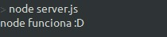
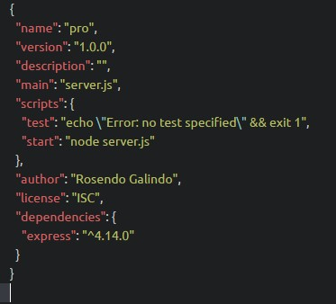
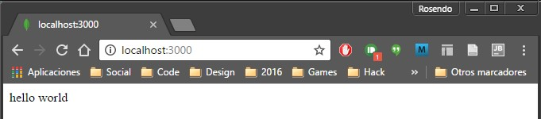
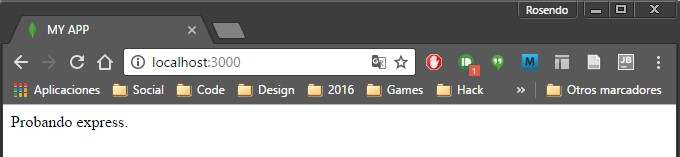
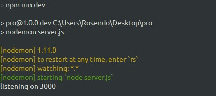

# CRUD,  NodeJS, Express y MongoDB

Express es un framework para la creación de aplicaciones web en la parte superior de Node.js. Se simplifica el proceso de creación del servidor que ya está disponible en Node.

MongoDB es un gestor de base de datos. Este es el lugar donde almacena la información para sus sitios web o aplicaciones web.

CRUD es un acrónimo para crear, leer, actualizar y eliminar. Se trata de un conjunto de operaciones que obtenemos servidores para ejecutar (POST, GET, PUT y DELETE respectivamente). Esto es lo que hace cada operación:

* Crear (POST) - Hacer algo
* Leer (GET) - Obtener algo
* Actualización (PUT) - cambiar algo
* Delete (BORRAR) - Quitar algo

Si ponemos CRUD, Express y MongoDB juntos en un solo diagrama, esto es lo que se vería así:


# Empezando
Para comenzar, cree una carpeta para este proyecto. Una vez que estemos en ella, ejecute el comando npm init.

Este comando crea un archivo package.json que le ayuda a gestionar las dependencias que instalamos más adelante.
```
$ npm init
```

# Ejecución de Node

La forma más sencilla de utilizar node es ejecutar el comando node y especificar una ruta a un archivo. Vamos a crear un archivo llamado server.js para ejectutar con node.
```
$ touch server.js
```

Cuando la ejecute el archivo server.js , queremos para asegurarse de que está funcionando correctamente. Para asegurarnos de esto escribimos una llamada a la funcion log.
```
console.log('Node funciona :D')
```

Ahora, ejecuta node server.js en la línea de comandos y debería ver el mensaje que escribio en la funcion log.

```
$node server.js
```



# Utilizando de Express
Primero tenemos que instalar express antes de que podamos usar en nuestra aplicación. La instalación Express es bastante fácil. Todo lo que tenemos que hacer es ejecutar un comando de instalación con el administrador de paquetes de Node (NPM), que se suministra junto con Node.
Ejecuta npm install express --save en la línea de comandos:
```
$ npm install express --save
```

Una vez que haya terminado, nos podemos dar cuenta que  npm ha guardado Express como una dependencia en package.json.


A continuación, utilizamos express en el archivo server.js haciendo un require.
``` javascript
const express = require('express');
const app = express();
```
Lo primero que queremos hacer es crear un servidor en el que los navegadores pueden conectarse. Podemos hacerlo con la ayuda de un método listen proporcionado por express:
```javascript
app.listen(3000, function() {
  console.log('listening on 3000')
})
```

Ahora, ejecuta node server.js y navegue hasta localhost:3000 en el navegador. Debería ver un mensaje que dice "no se puede obtener /".

Eso es una buena señal. Esto significa que ahora podemos comunicar a nuestro servidor express a través del navegador .

Aquí es donde comenzamos operaciones CRUD.

# CRUD - READ [LEER]

La operación LEER  se realiza por los navegadores cada vez que visita una página web. Bajo el capó, los navegadores envía una solicitud GET al servidor para realizar una operación de lectura. La razón por la que vemos el error "no se puede obtener /" es porque todavía no enviamos nada de vuelta al navegador de nuestro servidor.

En Express, manejamos una peticion GET con el metodo get:
```javascript
app.get(path, callback)
```
**El primer argumento**,path es el camino de la solicitud GET. Es todo lo que viene después de que su nombre de dominio.

Cuando estamos visitando localhost:3000, nuestros navegadores están buscando realmente localhost:3000/. El argumento de la ruta en este caso es /.

**El segundo argumento** es una función de devolución de llamada que le dice al servidor qué hacer cuando se compara la trayectoria. Toma en dos argumentos, un objeto de petición y respuesta de un objeto:
```javascript
app.get('/', function (request, response) {
  // do something here
})
```
Por ahora, vamos a escribir "Hello World" de vuelta al navegador. Lo hacemos mediante el uso de un metodo send que viene con el objeto de respuesta:
```javascript
app.get('/', function(req, res) {
  res.send('Hello World')
})
// Note: request and response are usually written as req and res respectively.
```

El codigo escrito esta en ES5 y para fines de aprender mas se va convertir a ES6. En primer lugar, se reemplaza la function()con la función de flecha ES6 . El código siguiente es el mismo que el código anterior:
```javascript
app.get('/', (req, res) => {
  res.send('hello world')
})
```
Ahora, reinicie el servidor mediante el procedimiento siguiente:
Detener el servidor actual con CTRL + C en la línea de comandos.
Ejecuta node server.js de nuevo.

A continuación, vaya a localhost:3000en su navegador. Usted debe ser capaz de ver una cadena que dice "Hello World".


Estupendo. Vamos a cambiar nuestra aplicación para que mande una pagina index.html al navegador en su lugar. Para ello, se utiliza el metodo sendFile que se proporciona por el objeto res.
```JavaScript
app.get('/', (req, res) => {
  res.sendFile(__dirname + '/index.html')
  // Note: __dirname is directory that contains the JavaScript source code. Try logging it and see what you get!
  // Mine was '/Users/zellwk/Projects/demo-repos/crud-express-mongo' for this app.
})
```
En el método sendFile  anterior, le dijimos a Express para enviara un archivo  index.html que se encuentra en la raíz de la carpeta del proyecto. No tenemos ese archivo aún. Vamos a hacerlo ahora.
```
$touch index.html
```
Vamos a poner un poco de texto en nuestro index.htmlarchivo, así:
```html
<!DOCTYPE html>
<html lang="en">
<head>
  <meta charset="UTF-8">
  <title>MY APP</title>
</head>
<body>
  Probando express.
</body>
</html>
```
Reinicie el servidor y actualice su navegador. Sera capaz de ver los resultados de su archivo HTML ahora.



En este punto, se habrá dado cuenta de que es necesario reiniciar el servidor cada vez que se realiza un cambio server.js. Este es el proceso es increíblemente tedioso, así que vamos a echar un desvío rápido y hacerlo más eficiente mediante el uso de un paquete llamado nodemon .

# Usando Nodemon
Nodemon reinicia el servidor automáticamente cada vez que guarde un archivo que utiliza el servidor. Podemos instalar Nodemon utilizando el siguiente comando:
```
$ npm install nodemon --save-dev
```

Nota: La razón por la que estamos usando una bandera --save-dev  aquí es porque sólo estamos utilizando Nodemon cuando estamos desarrollando.

Nodemon se comporta exactamente igual que Node, lo que significa que podemos ejecutar nuestro servidor llamando nodemon server.js. Sin embargo, no podemos hacerlo en la línea de comandos en este momento porque Nodemon no se instala con una bandera -g.

Hay otra forma de ejecutar Nodemon - podemos ejecutar Nodemon de la carpeta node_modules . El código es el siguiente:
```
$ ./node_modules/.bin/nodemon server.js
```
Eso es un puñado de escribir. Una forma de hacerlo más sencillo es crear una clave script en el archivo package.json.
```javascript
{
  // ...
  "scripts": {
    "dev": "nodemon server.js"
  }
  // ...
}
```
Ahora, puede ejecutar npm run dev para disparar nodemon server.js.
```
$npm run dev
```


# CRUD - CREATE [CREAR]

La operacion CREATE se realiza sólo por el navegador si una solicitud de POST se envía al servidor. Esta solicitud POST puede dispararse tanto con JavaScript o a través de una etiqueta <form>.

Vamos a ver cómo utilizar un etiqueta <form> para crear nuevas entradas para nuestra aplicacion de alumnos.
Para ello, primero hay que crear un <form> y añadirlo al archivo index.html. Es necesario tener tres cosas en este form:
Un atributo action, un atributo method y name.
los atributos de todos los elementos <input>  dentro del form.
```html
<form action="/alumnos" method="POST">
  <input type="text" placeholder="Nombre" name="name">
  <input type="text" placeholder="Numero de control" name="control">
  <button type="submit">Registrar</button>
</form>
```
El atributo action indica al navegador dónde navegar en nuestra aplicación Express. En este caso, estamos navegando a /alumnos. El atributo method  indica al navegador qué petición de enviar. En este caso, se trata de una solicitud POST.
En nuestro servidor, podemos manejar esta solicitud POST con un método post  que proporciona express. Toma los mismos argumentos que el método GET:
```javascript
app.post('/alumnos', (req, res) => {
  console.log('Hellooooooooooooooooo!')
})
```
Reinicie el servidor (es de esperar que haya configurado Nodemon por lo que se reinicia automáticamente) y actualice su navegador. A continuación, introduzca algo en el formulario y presione registrar. Usted debe ser capaz de ver Hellooooooooooooooooo!en la línea de comandos.

Hasta ahora sabemos que express maneja el formulario por nosotros. La siguiente pregunta es, ¿cómo podemos obtener los valores de entrada con Express?

Resulta que express no se ocupa de la lectura de datos desde el elemento <form> por sí mismo. Tenemos que añadir otro paquete llamado boy-parser para obtener esta funcionalidad.
```
$ npm install body-parser --save
```

Express nos permite añadir middleware como body-parser para nuestra aplicación con el método use . Oirás el término middleware mucho cuando se trata de Express. Estas cosas son básicamente los plugins que cambian la petición o respuesta objeto antes de que sean manejados por nuestra aplicación. Asegúrese de colocar el body-parser al principio del archivo server.js  antes de que cualquier  manipulador CRUD!
```javascript
const express = require('express')
const bodyParser= require('body-parser')
const app = express()

app.use(bodyParser.urlencoded({extended: true}))

// All your handlers here...
```

El método urlencoded  dentro del body-parser es para extraer los datos del elemento <form> y añadirlos a la propiedad body  en el objeto request.

Ahora, usted debería ser capaz de ver todo en el campo de formulario dentro del objeto req.body. Intenten hacer un console.log y ver lo que es!
```javascript
app.post('/alumnos', (req, res) => {
  console.log(req.body)
})
```
Usted debe ser capaz de obtener un objeto similar a la siguiente en la línea de comandos:
//Imagen Rosendoynumero de control

Ahora vamos a almacenar la informacion que se envia por el formulario en una base de datos de MongoDB

# MongoDB
Primero tenemos que instalar el driver de MongoDB través de la npm si queremos usarlo como base de datos.
```
$npm install mongodb --save
```
Una vez instalado, podemos conectar a MongoDB a través del método Mongo.Client como se muestra en el siguiente código:
```javascript
const MongoClient = require('mongodb').MongoClient

MongoClient.connect('mongodb://direccionIp:puerto/baseDeDatos', (err, database) => {
  // ... start the server
})
```

A continuación, queremos empezar nuestros servidores de NodeJS sólo cuando está conectada la base de datos. Por lo tanto, vamos a pasar app.listen en el método connect . También vamos a crear una variable db  que nos permitirá utilizar la base de datos cuando manejamos las solicitudes del navegador.

```javascript
var db;

MongoClient.connect('your-mongodb-url', (err, database) => {
  if (err) return console.log(err)
  db = database
  app.listen(3000, () => {
    console.log('listening on 3000')
  })
})
```

Hemos terminado la configuración de MongoDB. Ahora, vamos a crear una colección alumnos para almacenar la informacion que manejamos.
**Nota:** una colección es una ubicación con nombre para almacenar cosas, como una table de mysql, sqlServer, oracle, postgre, etc.

Podemos crear la colección alumnos mediante la cadena alumnos cuanto llamamos al método MongoDB db.collection(). Durante la creación de la colección de alumnos, también podemos guardar nuestra primera entrada en MongoDB con el método save de forma simultánea.

Una vez que hemos terminado de guardar, tenemos que redirigir al usuario en algún lugar (o que tendremos que aguantar para siempre a la espera de nuestro servidor de moverse). En este caso, vamos a redirigir de nuevo a /, lo que hace que el navegador recargue la pagina.
```javascript
app.post('/alumnos', (req, res) => {
  db.collection('alumnos').save(req.body, (err, result) => {
    if (err) return console.log(err)

    console.log('saved to database')
    res.redirect('/')
  })
})
```

Ahora, si se introduce algo en el elemento <form>, podrás ver una entrada en su colección MongoDB.

# Mostrando los alumnos a los usuarios

Tenemos que hacer dos cosas para mostrar la informacion almacenada en MongoLab a nuestros usuarios.

Obtener los documentos de MongoDB
Usat un motor de plantillas para mostrar los documentos

## Vayamos un paso a la vez.
Podemos obtener las cotizaciones de MongoLab utilizando el método find  que está disponible en el método collection .
```javascript
app.get('/', (req, res) => {
  var cursor = db.collection('alumnos').find();
})
```
El método find devuelve un cursor(Un Objecto de Mongo ) que, probablemente, no tiene sentido si lo imprimimos con console.log.

La buena noticia es que este objeto cursor contiene todos los documentos de nuestra base de datos. También contiene un montón de otras propiedades y métodos que nos permiten trabajar con datos fácilmente. Uno de tales métodos es el método toArray .

El método toArray toma en una función de callback que nos permite hacer cosas con los documentos que se obtengan de MongoDB. Vamos a tratar de hacer un console.log() para los resultados y ver lo que tenemos!
```javascript
db.collection('alumnos').find().toArray(function(err, results) {
  console.log(results)
  // send HTML file populated with students here
})
```
Ahora puede ver una serie de alumnos (sólo tengo uno ahora mismo). Hemos completado la primera parte - datos obtenidos de MongoDB. La siguiente parte es generar un código HTML que contiene todos nuestros documentos.

No podemos servir a nuestro archivo index.html  y esperar que aparecen mágicamente entre comillas porque no hay manera de añadir contenido dinámico a un archivo HTML. Lo que podemos hacer en su lugar, es ayudarnos con el uso de motores de plantillas . Algunos motores de plantilla populares incluyen Jade, JavaScript incrustado y Nunjucks.

Vamos a utilizar Embedded JavaScript ( ejs) como nuestro motor de plantillas porque es el más fácil para empezar. Encontrarás que es familiar de el primer momento si tienes conocimientos de HTML y JavaScript.

Para usar EJS primero necesitamos instalarlo y despues configurar express para que use como motor de plantillas a EJS.
```
$ npm install ejs --save
```
```javascript
app.set('view engine', 'ejs');
```

Una vez que el view engine se establece, podemos empezar a generar el código HTML con nuestros alumnos.
 Este proceso también se denomina prestación . Podemos utilizar la funcion render del objeto response . Tiene la siguiente sintaxis:
```javascript
res.render(view, locals);
```
El primer parámetro,views es el nombre del archivo que estaremos monstrando la informacion. Este archivo debe ser colocado dentro de una carpeta views [Segun la estandarizacion de express].
El segundo parámetro, los locals , es un objeto que pasa los datos a la vista.

Primero vamos a crear un archivo index.html.ejs  dentro de la carpeta views  para que podamos comenzar a rellenar datos.
```
mkdir views
touch views/index.ejs
```
Ahora, coloque el siguiente código dentro index.html.ejs.
```html
<ul class="alumnos">
  <% for(var i=0; i<alumnos.length; i++) {%>
    <li class="alumno">
      <span><%= alumnos[i].name %></span>
      <span><%= alumnos[i].control %></span>
    </li>
  <% } %>
</ul>
```
Véase lo que quiero decir cuando digo que lo encontrará familiar? En EJS, puede escribir JavaScript dentro de las etiquetas <%y %>. Puede también imprimir variables de JavaScript como cadenas si se utilizan las etiquetas <%=y %>.
Aquí, se puede ver que estamos básicamente haciendo  un bucle a través de la matriz alumnos y crear cadenas con alumnos[i].name y alumnos[i].control.

Una cosa más que hacer antes de pasar desde el archivo index.html.ejs . Recuerde que debe copiar el elemento <form> del archivo index.html  en este archivo también. El archivo index.html.ejs hasta ahora debe ser:
```html
<!DOCTYPE html>
<html lang="en">
<head>
  <meta charset="UTF-8">
  <title>MY APP</title>
</head>
<body>

  <ul class="alumnos">
  <% for(var i=0; i<alumnos.length; i++) {%>
    <li class="alumno">
      <span><%= alumnos[i].name %></span>
      <span><%= alumnos[i].control %></span>
    </li>
  <% } %>
  </ul>

  <form action="/alumnos" method="POST">
    <input type="text" placeholder="Nombre" name="name">
    <input type="text" placeholder="Numero de control" name="control">
    <button type="submit">Registrar</button>
  </form>
</body>
</html>
```
Por último, tenemos que hacer que este archivo index.html.ejs manipule la petición GET . Aquí, estamos estableciendo los resultados (una matriz) como la matriz alumnos que usamos en index.html.ejs anteriormente.
```javascript
app.get('/', (req, res) => {
  db.collection('alumnos').find().toArray((err, result) => {
    if (err) return console.log(err)
    // renders index.ejs
    res.render('index.html.ejs', {alumnos: result})
  })
})
```

Ahora, al actualizar el navegador, usted debería ser capaz de ver los alumnos almacenados en la base de datos.

# CRUD - UPDATE [ACTUALIZACIÓN]

La operación ACTUALIZACIÓN se utiliza cuando se quiere cambiar algo. Sólo puede ser desencadenada por los navegadores a través de una peticion PUT . Al igual que la solicitud POST , la solicitud PUT puede ser activada ya sea a través de JavaScript o a través de una etiqueta <form>.

Vamos a tratar de desencadenar una solicitud PUT a través de JavaScript en esta ocasión puesto que ya hemos aprendido cómo activar una solicitud a través de un elemento <form> al pasar por la peticion POST en la seccion anterior.

Vamos a crear un botón que, cuando se hace clic, se sustituirá el numero de control de un nombre dado.

Para ello, primero vamos a crear un archivo llamado update.html.ejs:
```html
<% include header.html.ejs %>
<ul class="quotes">
<% for(var i=0; i<alumnos.length; i++) {%>
  <li class="quote">
    <span><%= alumnos[i].name %></span>
    <span><%= alumnos[i].control %></span>
  </li>
<% } %>
</ul>

<div class="formi">
  <form >
    <input type="text" placeholder="Nombre" name="name" id="name">
    <input type="text" placeholder="Numero de control" name="control" id="control">
  </form>
<h2>Boton para reemplazar informacion de documento</h2>
<input type="button" value ="Reemplazar" id="update">
</div>
<script type="text/javascript" src="update.js"></script>
<% include footer.html.ejs %>
```

También vamos a crear un archivo JavaScript externo para ejecutar la peticion PUT cuando se haga clic en el botón. De acuerdo con las convenciones Express, este archivo se coloca en una carpeta llamada public
```
$ mkdir public
$ touch public/update.js
```
Entonces, tenemos que decirle a Express para hacer esta carpeta accesible al público mediante el uso de un middleware incorporado llamado express.static
```JavaScript
app.use(express.static('public'))
```

Una vez hecho esto, podemos añadir el archivo update.js al archivo update.ejs:
```html
<!-- ... -->
<script src="update.js"></script>
</body>
```

A continuación, vamos a enviar la peticion PUT cuando se hace clic en el botón:
```javascript
// update.js
var update = document.getElementById('update')

update.addEventListener('click', function () {
  // Send PUT Request here
})
```

La forma más fácil de activar una solicitud PUT en los navegadores modernos es utilizar la API de Fetch . Sólo es compatible con Firefox, Chrome y Opera.

Vamos a enviar la siguiente petición de recuperación al servidor.

```javascript
fetch('alumnos', {
method: 'put',
headers: {'Content-Type': 'application/json'},
body: JSON.stringify({
  'name': name,
  'control': control
})
})
```

Fetch toma en dos parámetros. El primer parámetro es un camino. En este caso, estamos enviando la solicitud a /alumnos, que será manejado en nuestro servidor.

El segundo parámetro, options, es un objeto opcional que le permite controlar una serie de situaciones diferentes. Los que usamos anteriormente son method, headers y body.
method es sencillo. Hemos establecido el method que ya estamos enviando una solicitud PUT.
headers aquí se refiere a Encabezados HTTP que desea enviar al servidor. Es un objeto con varios pares de valores clave.
body se refiere al contenido que usted envíe al servidor.

Hemos convertido las variables nombre  y control en JSON en el body con JSON.stringify. Estamos haciendo estos pasos, ya que estamos enviando la informacion en el formato JSON (un formato estándar para el envío de información en la web) en el servidor.

Por desgracia, nuestro servidor no lee datos JSON todavía. Podemos enseñar a leer los datos JSON utilizando el middleware  bodyparser.json():

```javascript
app.use(bodyParser.json())
```

Una vez que hemos hecho todo lo anterior, vamos a ser capaces de manejar esta solicitud PUT utilizando el método put:
```javascript
app.put('/alumnos', (req, res) => {
  // Handle put request
})
```
El próximo paso, entonces, es aprender a buscar el alumnos con cierta informacion.

## Actualización de una colección en MongoDB

El driver de MongoDB viene con un método llamado findOneAndUpdateque nos permite cambiar un elemento de la base de datos. Toma en cuatro parámetros - query, update, options y callback.
```JavaScript
db.collections('alumnos').findOneAndUpdate(
  query,
  update,
  options,
  callback
)
```

El primer parámetro,query , nos permite filtrar la colección a través de pares de clave y valor dado a la misma. Podemos filtrar la colección alumnos ajustando el name como variable.
```javascript
{
  name: name
}
```
El segundo parámetro, update, dice a MongoDB qué hacer con la solicitud de actualización. Utiliza operadores de actualización de MongoDB como $set, $inc y $push. Vamos a utilizar el operador $set ya que estamos cambiando la informacion de alumnos:
```javascript
{
  $set: {
    name: req.body.name,
    control: req.body.control
  }
}
```

El tercer parámetro, options, es un parámetro opcional que le permite definir las cosas adicionales. Ya que estamos en busca del nombre de un alumno, vamos a establecer sort dentro de las opciones a {_id: -1}. Esto permite a MongoDB buscar a través de la base de datos, a partir de la entrada más reciente.
```javascript
{
  sort: {_id:-1}
}
```

Hay una posibilidad de que no existan registros en nuestra base de datos. MongoDB no hace nada por defecto cuando esto sucede. Podemos obligarlo a crear una nueva entrada si fijamos la opción upsert, lo que significa insertar (o guardar) si no se encuentran entradas, como true:
```javascript
{
  sort: {_id: -1},
  upsert: true
}
```

El último parámetro es una función de devolución de llamada que le permite hacer algo una vez MongoDB ha sustituido la informacion. En este caso, podemos enviar los resultados a la solicitud de obtención de información.
```javascript
(err, result) => {
  if (err) return res.send(err)
  res.send(result)
}
```

Aquí está todo el findOneAndUpdatecomando que hemos escrito en los dos pasos anteriores:
```JavaScript
app.put('/alumnos', (req, res) => {
  // Handle put request
  //console.log(req);
  db.collection('alumnos').findOneAndUpdate(
    {name: req.body.name}, {
    $set: {
      name: req.body.name,
      control: req.body.control
    }
  }, {
    sort: {_id: -1},
    upsert: true
  }, (err, result) => {
    if (err) return res.send(err)
    res.send(result)
  });
});
```

Ahora, cada vez que alguien hace clic en el botón de actualización, el navegador enviará una solicitud PUT a través de Fetch a nuestro servidor Express.

La forma correcta de comprobar si la peticion se ha resuelto con éxito es utilizar el método ok en el objeto response. A continuación, puede agregar return res.json(), si desea leer los datos que se envían desde el servidor:
```JavaScript
fetch({ /* request */  })
.then(res => {
  if (res.ok) return res.json()
})
.then(data => {
  console.log(data)
})
```

Agregando esta parte en la que utiliza JavaScript para actualizar el DOM para que los usuarios puedan ver los nuevos cambios de forma inmediata.
```javascript
fetch({ /* request */ })
.then(res => {
  if (res.ok) return res.json()
})
.then(data => {
  console.log(data)
  window.location.reload(true)
})
```

Eso es todo por la operación UPDATE! Vamos a pasar a la final - BORRAR.

# CRUD - DELETE [BORRAR]

La operación DELETE sólo puede ser activado a través de una petición DELETE. Es similar a la peticion ACTUALIZACIÓN, por lo que es simple si se entiende lo que hemos hecho anteriormente.

Para esta parte, vamos a aprender a eliminar un alumnos por su numero de control. Para hacerlo, primero tenemos que añadir un botón para el archivo delete.html.ejs. Pero antes crear un archivo llamado update.html.ejs.
```html
<% include header.html.ejs %>
<ul class="quotes">
<% for(var i=0; i<alumnos.length; i++) {%>
  <li class="quote">
    <span><%= alumnos[i].name %></span>
    <span><%= alumnos[i].control %></span>
  </li>
<% } %>
</ul>

<div class="formi">
  <form >
    <input type="text" placeholder="Numero de control" name="control" id="control">
  </form>
  <h2>Boton para borrar documentos</h2>
  <input type="button" value ="Borrar" id="delete">
</div>
<script type="text/javascript" src="delete.js"></script>
<% include footer.html.ejs %>
```

A continuación, vamos a desencadenar una solicitud BORRAR a través de Fetch cada vez que se hace clic en el botón de borrar:
```JavaScript
var del = document.getElementById('delete');

del.addEventListener('click', function () {
  var  control = document.getElementById('control').value;
  fetch('alumnos', {
    method: 'delete',
    headers: {
      'Content-Type': 'application/json'
    },
    body: JSON.stringify({
      'control': control
    })
  }).then(res => {
  if (res.ok) return res.json()
}).then(data => {
  console.log(data);
  window.location.reload(true)
})
});

```

A continuación, podemos controlar el evento en nuestro lado del servidor con el deletemétodo:
```JavaScript
app.delete('/alumnos', (req, res) => {
  // Handle delete event here
})
```

## Eliminación de una entrada en MongoDB
El driver de MongoDB vienen con un método llamado findOneAndDeleteque nos permite eliminar un elemento de la base de datos. Toma en tres parámetros - query, options y un callback. Estos parámetros son exactamente los mismos que los que se utilizó en findOneAndUpdate a la hora de actualizar una entrada en MongoDB. La única diferencia aquí es que no hay upsert dentro de options.
```JavaScript
db.collections('alumnos').findOneAndDelete(
  query,
  options,
  callback
)
```

Recuerde, estamos tratando de eliminar el alumno con un numero de control en especifico. Para ello, vamos a filtrar la colección alumnos por el numero de control de la peticion. El parámetro query es por lo tanto:
```JavaScript
{
  name: req.body.control
}
```

Podemos omitir el parámetro options ya que no tenemos que invertir el orden de clasificación. Entonces, podemos enviar una copia de la respuesta a la solicitud Fetch en la función de devolución de llamada.
```javascript
(err, result) => {
  if (err) return res.send(500, err)
  res.send(result)
});
```

El código completo para el manejador de eliminación es la siguiente:

```JavaScript
app.delete('/alumnos', (req, res) => {
  //console.log(req);
  db.collection('alumnos').findOneAndDelete({control: req.body.control},
  (err, result) => {
    if (err) return res.send(500, err)
    res.send(result)
  });
});
```
Ahora, cada vez que alguien hace clic en el botón de borrar, el navegador enviará una solicitud BORRAR a través de Fetch a nuestro servidor Express. A continuación, el servidor responde enviando ya sea un error o un mensaje de vuelta.
Al igual que antes, podemos recargar la página web cuando la zona de alcance se ha completado con éxito.
```JavaScript
fetch({ /* request */ })
.then(res => {
  if (res.ok) return res.json()
})
.then(data => {
  console.log(data)
  window.location.reload(true)
})
```
Eso es todo por la operación DELETE !
